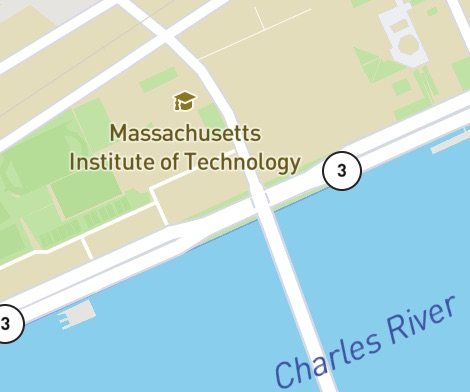

# MIT Assignments
 
This repository has my assignments for the MIT x Pro course: Professional Certificate in Coding: Women's Cohort (April 2021). 
<link href="https://getbootstrap.com/docs/5.0/examples/navbars/" here> are the folers for each of the assignments described below. 

 

### PacMan Exercie
 

This exercise includes a web-page where a PacMan moves accross the screen. The PacMan should reverse the direction that it is moving and the direction that it is facing when it reaches the end of the screen.   

 

### Eyes Exercie
 

This exercise includes a web-page where two eyes move around to follow the cursor.

### Bus Tracking Exercie
 

This exercise includes a web-page the shows the location of bus stops between Harvard and MIT. The location marker starts and MIT, once the button to show bus stops is pressed, the marker moves every second to each bus stop until it reaches Harvard.
